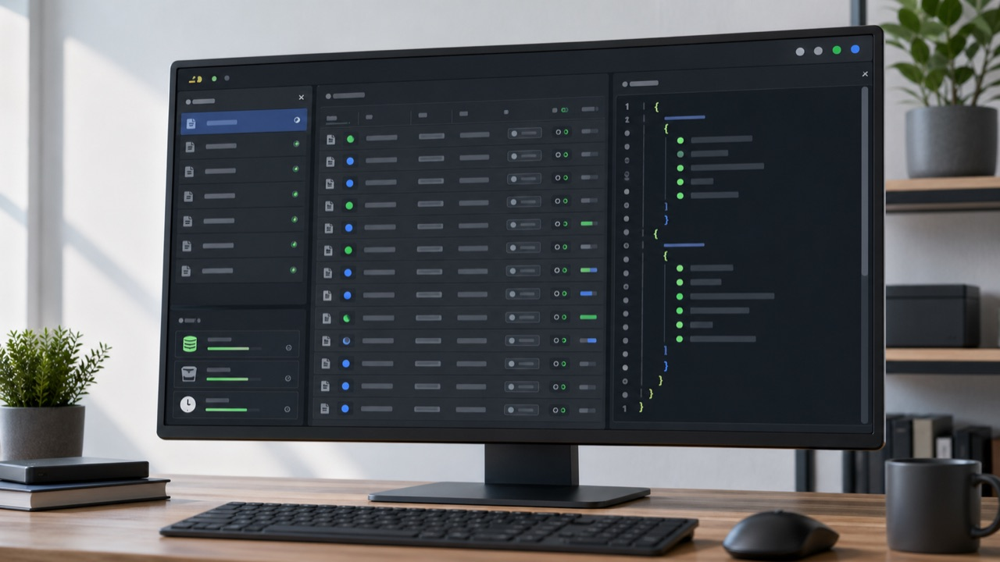

# coldxx

[English](README.md)


[](https://nodejs.org/)
[](LICENSE)
[](package.json)

本机 Codex session 管理工具。coldxx 读取 `~/.codex/sessions/YYYY/MM/DD/` 下的 JSONL session 文件，帮你查看、清理、备份、恢复和谨慎修改历史记录。所有操作都在本机完成，session 内容不会被上传到远程服务。



## 适合做什么

- 找到最近的 Codex session，查看它的项目目录、模型、大小、记录数和文件路径。
- 批量清理历史 session，默认移动到 Trash，后续还能恢复。
- 打开图形界面，优先按对话轮查看，再按需展开底层 JSONL 明细。
- 快速修改某一轮对话中的用户输入或助手输出。
- 快速回退到某一轮对话状态，删除这轮之后的 JSONL 记录。
- 修改某个 session 里的历史文本，例如把误粘贴的 token 替换成 `[REDACTED]`。
- 删除 JSONL 中的指定记录行，并自动创建备份。
- 在改错后，从操作历史或 Trash 中快速回滚。

## 安装

要求 Node.js 20 或更新版本。

```sh
npm install -g coldxx
```

如果你使用的 npm 镜像还没有同步，可以直接走 npm 官方源：

```sh
npm install -g coldxx --registry=https://registry.npmjs.org/
```

从源码运行：

```sh
git clone https://github.com/outx-sec/coldxx.git
cd coldxx
npm install
npm link
```

```sh
node ./src/cli.js list
```

## 30 秒上手

先确认安装到的版本：

```sh
coldxx -v
```

先确认 coldxx 看到的是哪些目录：

```sh
coldxx doctor
```

列出最近 20 个 session：

```sh
coldxx list --limit 20
```

打开图形界面：

```sh
coldxx ui
```

命令会输出一个带 token 的本机地址，例如：

```text
http://127.0.0.1:4765/?token=...
```

默认只监听 `127.0.0.1`。浏览器里的 API 请求必须带这个 token。

## 常用任务

### 查看 session

```sh
coldxx list --limit 20
coldxx list --all
coldxx list --query my-project
coldxx list --json
```

查看某一个 session：

```sh
coldxx show latest
coldxx show a1111111
coldxx show 1 --limit 50
coldxx show latest --raw
```

### 清理 session

先预览，不写文件：

```sh
coldxx clean a1111111 --dry-run
```

确认后移动到 Trash：

```sh
coldxx clean a1111111 --yes
```

一次清理多个 session：

```sh
coldxx clean a1111111 b2222222 c3333333 --yes
```

清理所有 session 前强烈建议先 dry-run：

```sh
coldxx clean-all --dry-run
coldxx clean-all --yes
```

管理 Trash：

```sh
coldxx trash list
coldxx trash restore <trash-id>
coldxx trash empty --yes
```

永久删除必须显式加 `--permanent --yes`：

```sh
coldxx clean a1111111 --permanent --yes
```

### 修改历史记录

替换文本时建议先 dry-run：

```sh
coldxx edit latest --replace API_KEY --with "[REDACTED]" --scope messages --dry-run
coldxx edit latest --replace API_KEY --with "[REDACTED]" --scope messages --yes
```

`--scope` 可选：

```text
all, messages, user, assistant, system, tool, metadata
```

支持正则替换：

```sh
coldxx edit latest --replace "sk-[A-Za-z0-9_-]+" --with "[REDACTED]" --regex --scope messages --yes
```

区分大小写替换：

```sh
coldxx edit latest --replace "API_KEY" --with "[REDACTED]" --case-sensitive --scope messages --yes
```

删除指定 JSONL 行号：

```sh
coldxx drop latest --lines 12-18 --dry-run
coldxx drop latest --lines 12-18 --yes
```

行号范围是 1-based，支持 `3`、`5-8`、`20-` 和逗号组合。

### 使用图形界面

```sh
coldxx ui
coldxx ui --host 127.0.0.1 --port 4765
```

图形界面适合做这些操作：

- 左侧选择 session，查看项目目录、摘要、大小和记录数。
- 在 Sessions 标题旁展开搜索，不影响当前布局。
- 中间以对话轮为主视图，点击 Turn 可定位到底层 `task_started` 行。
- 按文本、角色、记录类型、范围、大小写和正则筛选 Turn。
- 需要原始记录时再展开 JSONL Lines 明细；Lines 查找不会反向改变 Turn 列表。
- 在 Lines 里只查找，或启用替换后写入；如果上方有 Turn 筛选，替换会限制在当前 Turn 范围。
- 从 Turn 卡片快速修改这一轮的用户输入或助手输出。
- 从 Turn 卡片回退到此处，确认后删除后续 JSONL 记录。
- 右侧查看当前记录的 JSON，支持格式化、校验、复制和自动换行。
- 从 Trash 弹窗查看已删除 batch 里具体有哪些 session，再恢复或清空。
- 底部操作历史默认收起，需要时展开并回滚到自动备份。

## 选择 session 的写法

多数命令都接受同一套 selector：

| 写法 | 含义 |
| --- | --- |
| `latest` | 最新 session |
| `1`, `2`, `3` | `coldxx list` 的序号，按时间倒序 |
| `a1111111` | session id 前缀 |
| 完整 session id | 精确匹配 |
| `/path/to/session.jsonl` | 直接指定 JSONL 文件路径 |

## 安全机制

coldxx 默认偏保守，写入前尽量给你留下退路。

| 操作 | 默认行为 |
| --- | --- |
| `clean` / `clean-all` | 移动到 `~/.coldxx/trash/` |
| `edit` / `drop` / UI 保存 | 先备份到 `~/.coldxx/backups/` |
| 最近更新的 session | 默认拒绝写入，避免 Codex 仍在写文件 |
| 永久删除 | 必须同时提供 `--permanent` 和 `--yes` |
| 写操作 | 必须提供 `--yes`，或用 `--dry-run` 预览 |

最近 10 分钟内更新过的 session 会被视为可能仍在使用。确认 Codex 没有继续写入后，可以加：

```sh
coldxx clean latest --yes --allow-active
```

也可以调整窗口：

```sh
coldxx clean latest --yes --active-window-minutes 30
```

## 路径

默认路径：

```text
Codex home:    ~/.codex
Sessions root: ~/.codex/sessions
coldxx home:   ~/.coldxx
```

临时切换路径：

```sh
coldxx list --codex-home /path/to/.codex
coldxx list --coldxx-home /path/to/coldxx
CODEX_HOME=/path/to/.codex coldxx list
COLDXX_HOME=/path/to/coldxx coldxx list
```

## 开发

```sh
npm run check
npm test
```

项目目前没有运行时依赖。Codex session 的 JSONL 结构可能变化，所以 coldxx 尽量按通用 JSONL 记录处理，而不是绑定某个内部 schema。

## 隐私和声明

coldxx 是独立的本机工具，不隶属于 OpenAI。它只读取和修改你本机的 Codex session 文件，不会把 session 内容发送到远程服务。
